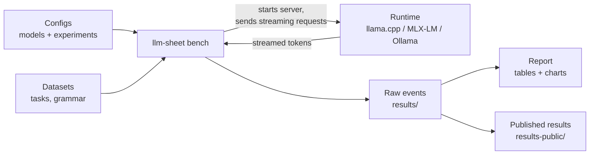
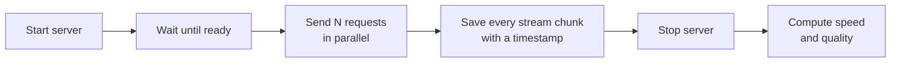
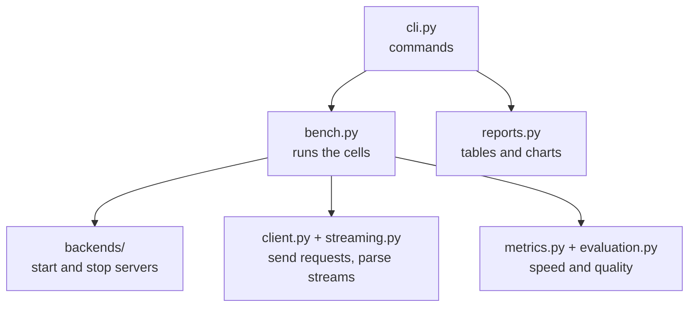

# Architecture

How the harness is put together: what goes in, what runs, and what comes out. For metric definitions and
measurement controls see [methodology.md](methodology.md).

## Overview

## One benchmark cell

A cell is one model on one runtime with one workload at one concurrency level.

## Code layout

## Design principles

- **Backends only control processes.** They launch the server, wait for readiness, report metadata and shut down.
  All measurement happens in the shared client, so TTFT and TPOT mean the same thing for every runtime.
- **Raw events are the source of truth.** Every stream chunk is stored with a monotonic timestamp in
  `events.jsonl.gz`. Metrics, quality scores and reports can always be recomputed (`report`, `evaluate --runs`).
- **Two kinds of workload.** `synthetic_tokens` measures speed on exact-length prompts. Application and proofreading
  workloads measure quality, scored deterministically in `evaluation.py` or with ERRANT in `proofread.py`.
- **Resumable runs.** `bench` recognizes completed cells by configuration identity and never overwrites them;
  `--fill-missing` completes items a run skipped because of its time limit.
- **Local and published results are separate.** `results/` is git-ignored; only what passes through
  `scripts/export_public.py` reaches `results-public/`. Git tracks its compact part; the raw files ship as a
  release asset (`results-public-full.tar.gz`).
